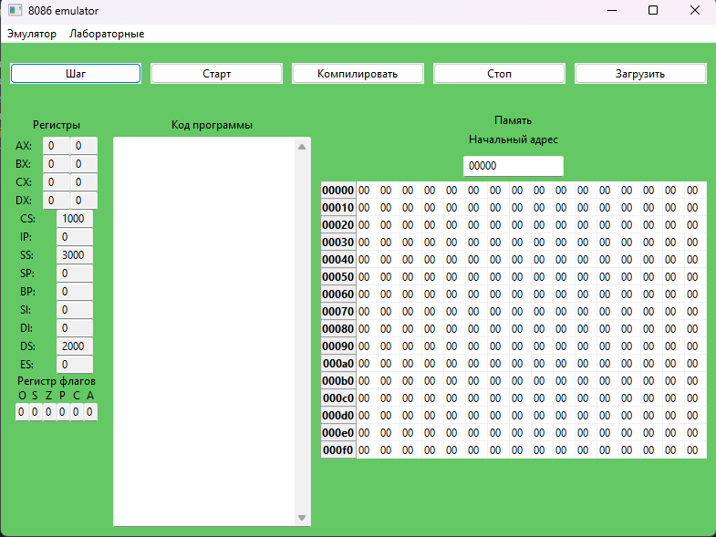
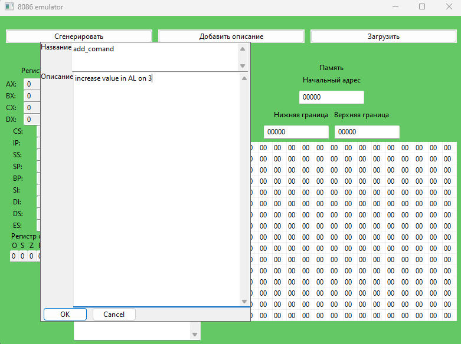
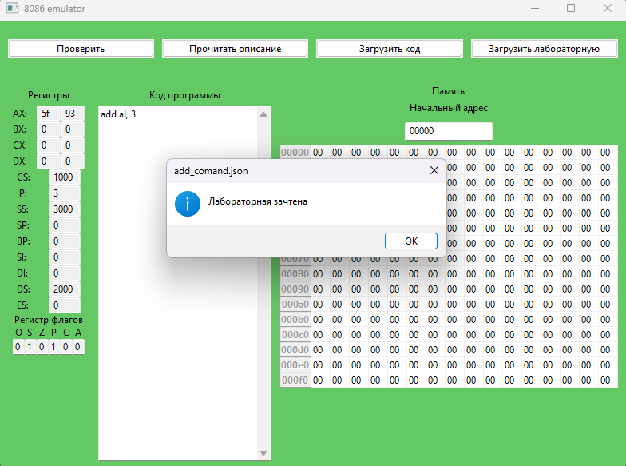
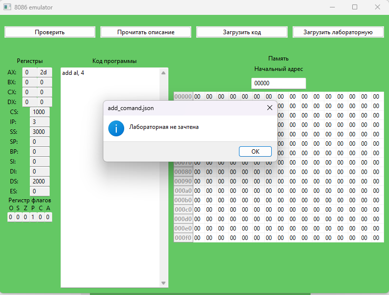

### Эмулятор процессора intel 8086
#### Описание
Данный эмулятор предназначен для создания и проверки лабораторных работ.
#### Песочница
При запуске программы пользователь попадает в песочницу. В данном режиме можно запускать программы на ассемблере и следить за их выполнением.
Перед запуском программы на ассемблере необходимо его скомпилировать соответствующей кнопкой. Эмулятор использует **FLAT ассемблер** для компиляции.
После этого можно выполнить программу целиком кнопкой **"Старт"** или пошагово кнопкой **"Шаг"**.
#### Лабораторные работы
##### Создание
Для создания лабораторной необходимо нажать на верхней панели "Лабораторные" -> "Создать лабораторную".
В данном режиме пользователь должен добавить описание лабораторной работы и её название, а так же написать исходный код программы, которая решает поставленную задачу. Далее необходимо выбрать регистры и блок памяти для проверки. Регистры задаются чекбоксами на против них, блок памяти задаётся пределами верхней и нижней границы памяти.
**Внимание! Описание и название должны задаваться на английском языке!**
После этого необходимо нажать на кнопку **"Сгенерировать"**. Будет создан файл <название_лабораторной>.json.
##### Проверка
Для проверки лабораторной работы необходимо нажать на верхней панели "Лабораторные" -> "Проверить лабораторную".
В данном режиме пользователь должен открыть .json файл лабораторной работы, прочитать описание и написать код программы, которая решает поставленную задачу.
При нажатии на кнопку **"Проверить"** запустится проверка, после чего будет сделан вывод о правильности выполнения задания.
#### Скриншоты
##### Песочница

##### Создание лабораторной

##### Успешная проверка

##### Неудачная проверка
